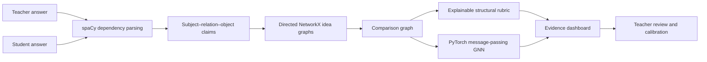

# IdeaGrade

### Explainable structural grading with graph neural networks

[](https://www.python.org/)
[](https://pytorch.org/)
[](https://streamlit.io/)
[](https://github.com/Arush-Reddy/IdeaGrade-GNN/actions/workflows/ci.yml)
[](LICENSE)

IdeaGrade asks a more interesting question than “does the answer contain the
right keywords?” It extracts the claims in a teacher answer and a student
answer, represents both as directed idea graphs, and evaluates whether the
student preserved the intended relationships between concepts.

The result combines transparent structural evidence with a small
message-passing GNN trained to predict rubric scores. Every prediction is shown
beside the underlying concepts and relationships so an educator can inspect,
challenge, or override it.

> **Status:** research and portfolio prototype for short factual explanations.
> It is not validated for autonomous or high-stakes grading.

## Why this project is different

Most introductory grading projects collapse an answer into keywords or a
single embedding similarity. IdeaGrade treats reasoning as structure:

- `plants → use → sunlight` and `plants → release → oxygen` become graph edges;
- reversed, missing, extra, and negated relationships remain inspectable;
- the deterministic score explains exactly what matched;
- the GNN learns patterns across paired teacher/student graphs; and
- evaluation holds out entire topics instead of randomly leaking variants of
  the same topic into both training and validation.

## System architecture



The comparison graph contains concept nodes, relationship nodes, directed
structural edges, cross-answer semantic matches, contradiction signals, and
graph-level coverage features. The neural model is implemented directly in
PyTorch to keep the message-passing mechanics visible.

## Evaluation snapshot

The included checkpoint was trained on **834 synthetic rubric-labelled answer
pairs across 18 topics**.

| Evaluation design | Result |
| --- | ---: |
| Topic-held-out validation MAE | **4.27 points** |
| Topic-held-out validation RMSE | **10.38 points** |
| Final all-data training MAE | 0.33 points |
| Held-out topics | climate change, photosynthesis, plate tectonics |

Holding out complete topics is more demanding than randomly splitting closely
related answer variants. The training/validation gap also shows that the model
overfits synthetic patterns; this is documented rather than hidden. See the
[model card](MODEL_CARD.md) for data provenance, limitations, and responsible
use guidance.

## Features

- Dual answer editor with a compact Streamlit interface.
- Explainable concept coverage, relationship accuracy, and structure metrics.
- GNN prediction displayed as a learned second opinion.
- Missing and additional claim evidence.
- Theme-aware graph visualizations without opaque image backgrounds.
- Teacher calibration capture for future supervised retraining.
- Downloadable structural report.
- Reproducible corpus generator and topic-held-out training pipeline.
- Docker, Streamlit Community Cloud, Procfile, and GitHub Actions support.

## Quick start

Python 3.12 is recommended.

```powershell
git clone https://github.com/Arush-Reddy/IdeaGrade-GNN.git
cd IdeaGrade-GNN
py -3.12 -m venv .venv
.\.venv\Scripts\Activate.ps1
python -m pip install -r requirements.txt
streamlit run streamlit_app.py
```

Open `http://localhost:8501`. The spaCy English pipeline is installed directly
from `requirements.txt`, and the repository includes the WordNet data required
by the model.

### Command-line usage

```powershell
python cli.py `
  --reference "Plants use sunlight to produce glucose." `
  --student "Plants use sunlight to make glucose."
```

## Reproduce the model

```powershell
python generate_training_data.py
python train_gnn.py
python -m unittest discover -s tests -v
```

The generator uses a fixed seed and recreates 792 examples. The additional 42
targeted synthetic cases live in `data/starter_training.jsonl`, giving the
checkpoint its reproducible total of 834 examples. Training metadata—including
the held-out topics, MAE, RMSE, feature version, and example count—is stored in
the checkpoint.

## Scoring

The explainable baseline uses:

- **30% concept coverage** — reference concepts found in the student graph;
- **45% relationship accuracy** — matching normalized directed claims; and
- **25% argument structure** — correct subject-to-object connections.

The GNN does not replace these metrics. It operates as a learned comparison
signal, while the evidence remains visible to the teacher.

## Repository map

```text
streamlit_app.py          Streamlit interface and interaction flow
analysis_service.py       UI-independent grading orchestration
extractor.py              spaCy and WordNet relationship extraction
graph_builder.py          Directed idea-graph construction
grader.py                 Explainable structural baseline
gnn_model.py              Comparison graph and GNN architecture
generate_training_data.py Reproducible synthetic corpus generator
train_gnn.py              Topic-held-out training and evaluation
MODEL_CARD.md             Model provenance, metrics, and limitations
tests/                    Pipeline and reproducibility regression tests
```

## Deployment

### Docker

```powershell
docker build -t ideagrade .
docker run --rm -p 8501:8501 ideagrade
```

### Streamlit Community Cloud

Create an app from this repository and select `streamlit_app.py` as the entry
point. The project uses deployment-safe paths and declares Python 3.12 in
`runtime.txt`.

Teacher calibrations are intentionally excluded from Git and container build
contexts. Production deployments should replace local JSONL persistence with
an authenticated database and an explicit data-retention policy.

## Research roadmap

- Collect anonymized, consented teacher labels from authentic student answers.
- Establish inter-rater agreement and an untouched external test set.
- Compare against TF-IDF, sentence-embedding, and cross-encoder baselines.
- Add calibrated prediction intervals instead of using global MAE as uncertainty.
- Evaluate robustness to grammar errors, implicit reasoning, and valid
  alternative explanations.
- Audit performance by subject, answer length, and relevant student subgroups.

## Responsible use

IdeaGrade is a teacher-assist tool. It should not assign final grades, rank
students, or make admissions or disciplinary decisions. Any classroom study
should use informed consent, anonymization, human review, and appropriate
institutional approval.

## License and citation

Released under the [MIT License](LICENSE). Citation metadata is available in
[`CITATION.cff`](CITATION.cff).
